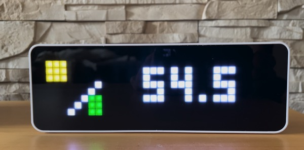

# energy-monitor

Energy monitor enables displaying information about energy production from solar panels and energy consumption from the grid for a household on a [Ulanzi TC001](https://www.ulanzi.com/products/ulanzi-pixel-smart-clock-2882) with the [Awtrix3 firmware](https://github.com/Blueforcer/awtrix3)

The solution is tailored to my specific setup, but can be easily adapted to other setups. It uses the the information [OpenDTU](https://github.com/tbnobody/OpenDTU) provides about the solar energy production and the information provided by the [Tibber Pulse Bridge](https://tibber.com/de/store/produkt/pulse-ir) (with web server enabled) to get the energy consumption. It also uses the [Tibber API](https://developer.tibber.com/docs/overview) to get the current price of electricity. The API key needs to be provided as an environment variable `TIBBER_API_KEY` as well as the password for accessing the web server on the Tibber Pulse Bridge `PULSE_BRIDGE_PASSWORD` when starting `emtibberd`. 

There are two parts to the solution:
1. [tibber-data-provider](tibber-data-provider) which reads the data from the Tibber Pulse Bridge and the Tibber API and publishes it to a MQTT broker
2. [matrix-display-driver](matrix-display-driver) which subscribes the data published by tibber-data-provider and the OpenDTU to the MQTT broker. It creates new MQTT publications in a format which the Awtrix firmware is able to display on the Ulanzi TC001

## Acknowledgements
This project contains some code from the [Rust tibber library](https://github.com/snakehand/tibber).

## License

Licensed under either of

- Apache License, Version 2.0 ([LICENSE-APACHE](LICENSE-APACHE) or
  http://www.apache.org/licenses/LICENSE-2.0)

- MIT license ([LICENSE-MIT](LICENSE-MIT) or http://opensource.org/licenses/MIT)

at your option.

### Contribution

Unless you explicitly state otherwise, any contribution intentionally submitted
for inclusion in the work by you, as defined in the Apache-2.0 license, shall be
dual licensed as above, without any additional terms or conditions.
